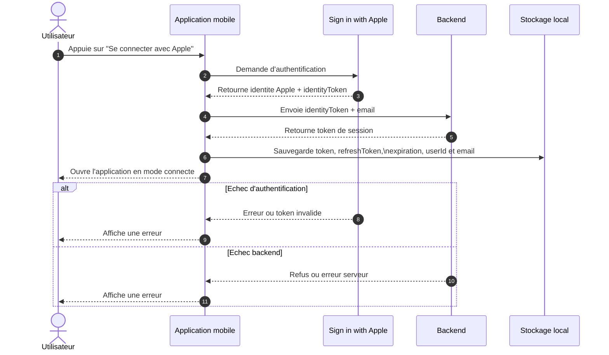
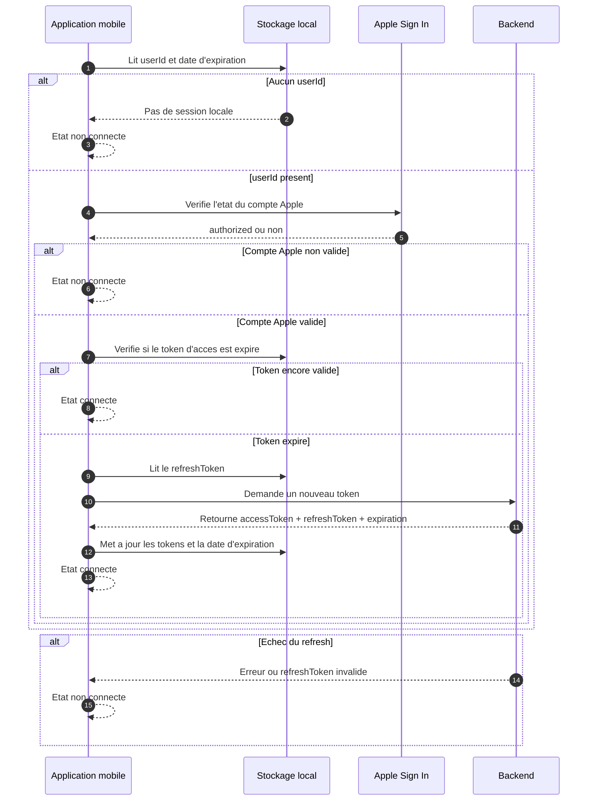
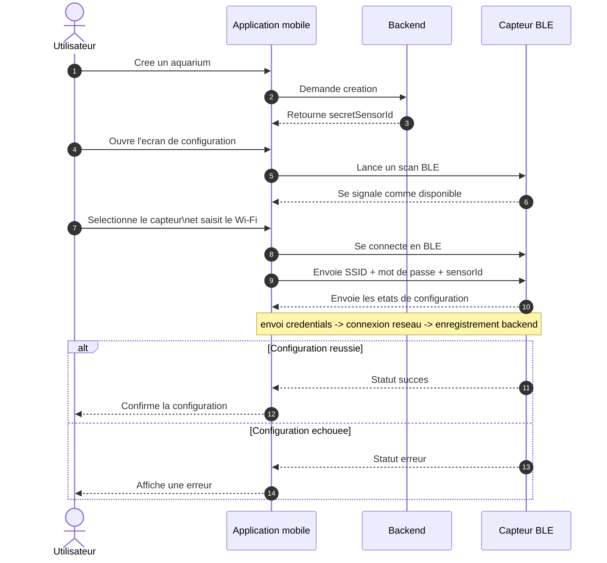

# Rapport technique - Application Izzirium

## 1. Introduction

Izzirium est une application iOS conçue pour superviser des aquariums connectes. Son rôle principal est de permettre à un utilisateur de s'authentifier, de créer et gérer ses aquariums, de configurer un capteur physique via Bluetooth Low Energy, puis de consulter les mesures remontées par ce capteur. L'application s'inscrit donc dans un contexte d'objet connecté, avec un lien direct entre une interface mobile, un backend distant et un équipement embarque.

Le fonctionnement global repose sur une chaîne simple. L'utilisateur ouvre l'application et s'authentifie avec son compte Apple. Une fois connecté, il peut accéder à la liste de ses aquariums, en créer un nouveau et lancer la configuration du capteur associe. Lors de cette phase, l'application récupère auprès du backend un identifiant technique de capteur, puis le transmet au module physique en même temps que les informations Wi-Fi. Quand cette configuration est terminée, les mesures peuvent être affichées dans l'application et exploitées pour le suivi quotidien de l'aquarium.

## 2. Fonctionnalites de l'application

Sur le plan fonctionnel, l'application propose d'abord un parcours de connexion base sur "Sign in with Apple". Ce choix permet de s'appuyer sur un mécanisme natif iOS, tout en déléguant l'identité et la sécurité de l'utilisateur à Apple et la création de session applicative au backend. Une fois la session établie, l'utilisateur accède à l'ensemble de ses aquariums.

L'écran principal présente une liste des aquariums disponibles ainsi qu'un aquarium favori. Cette notion de favori permet de mettre en avant un aquarium principal, tout en conservant l'accès aux autres éléments. L'utilisateur peut également rafraîchir la liste, supprimer un aquarium, ou en créer un nouveau. Lorsqu'un aquarium est sélectionné, l'application affiche une vue de détail regroupant les dernières mesures disponibles, les capteurs suivis et des accès vers les paramètres.

La partie métier la plus spécifique du projet concerne la configuration initiale du capteur. Lors de la création d'un aquarium, l'application récupère un identifiant de capteur fourni par le backend. Cet identifiant est ensuite réinjecte dans le flux BLE afin que le capteur puisse être associé au bon aquarium. L'application est capable de scanner les périphériques BLE, de se connecter à celui choisi par l'utilisateur, de lui transmettre les identifiants Wi-Fi et d'attendre le retour de statut de configuration.

Une fois le capteur opérationnel, l'utilisateur peut consulter les mesures par type de sonde. L'application affiche la valeur la plus récente, l'historique des relevés et des graphiques facilitant l'analyse. Des seuils minimum et maximum peuvent également être configurés afin de définir des bornes de fonctionnement normal. Cela permet de faire ressortir plus facilement les situations anormales dans l'interface.

## 3. Architecture generale

Le projet est organisé en plusieurs modules Swift distincts. Le module "Izzirium" contient l'application elle-même ainsi que la couche de présentation. On y retrouve les écrans SwiftUI, les view models et le coordinateur racine qui choisit quoi afficher selon l'état de connexion. Le module "Domain" porte la logique métier, les use cases, les modèles de domaine ainsi que le "PairingManager", qui joue un rôle central dans l'orchestration de la configuration BLE. Le module "Data" regroupe les repositories et les différentes sources de données, qu'elles soient locales ou distantes. Enfin, le module "DesignSystem" centralise les composants graphiques réutilisables pour garder une interface cohérente.

Cette organisation suit une architecture en couches. La présentation ne parle pas directement au backend ni au stockage local. Elle s'appuie sur des view models, qui déclenchent des use cases metier. Ces use cases utilisent ensuite les repositories de la couche "Data", lesquels délèguent le travail concret aux sources locales ou distantes. Pour la partie BLE, la logique métier passe par "PairingManager", qui orchestre le cycle de scan, de connexion et de provisioning, tandis que la communication bas niveau avec CoreBluetooth est encapsulée dans "BlePairingCentralManager".

L'application utilise également plusieurs dépendances transverses. "SKDependencyInjection" est employée pour injecter les dépendances entre modules. "SKState" structure les états de chargement et les retours de requêtes. "PapyrusAlamofire" est utilise pour les appels réseau. "Kastor" et les composants du design system servent respectivement au logging et a l'interface.

Le diagramme suivant résume l'architecture du projet.

'''mermaid
flowchart TD
    App[IzziriumApp]

    subgraph Presentation[Presentation - SwiftUI]
        Root[RootCoordinatorView]
        Screens[Ecrans et ViewModels Login, Aquarium, Configuration BLE, Settings]
    end

    subgraph Domain[Domain]
        UseCases[Use Cases Login, Session, Aquarium, Pairing BLE, Alerts]
        Managers[Managers metier PairingManager]
        Models[Modeles metier et etats]
    end

    subgraph Data[Data]
        Repos[Repositories UserRepository, AquariumRepository, AlertRepository, LogRepository]
    end

    subgraph Sources[Sources de donnees]
        Remote[Remote Data Sources API HTTP]
        Local[Local Data Sources Keychain, UserDefaults, Base locale]
        BLE[BLE Layer BlePairingCentralManager]
    end

    subgraph External[Dependances externes]
        Apple[Frameworks Apple SwiftUI, CoreBluetooth, AuthenticationServices]
        ThirdParty[SKDevKit, PapyrusAlamofire, Kastor]
        Backend[Backend]
        Sensor[Capteur BLE]
    end

    App --> Root
    Root --> Screens
    Screens --> UseCases
    Screens --> Managers

    UseCases --> Repos
    Managers --> BLE
    UseCases --> Models
    Managers --> Models

    Repos --> Remote
    Repos --> Local

    Remote --> Backend
    BLE --> Sensor

    Presentation -. utilise .-> Apple
    Domain -. utilise .-> ThirdParty
    Data -. utilise .-> ThirdParty
    BLE -. s'appuie sur .-> Apple
'''

Dans la pratique, cette architecture apporte une bonne séparation des responsabilités. La couche de présentation reste centrée sur l'interface et l'expérience utilisateur. La couche de domaine contient les règles fonctionnelles, comme la vérification de session ou la logique de provisioning BLE. La couche de données regroupe les détails techniques, ce qui rend le projet plus lisible et plus facile à faire évoluer.

## 4. Connexion utilisateur

La connexion utilisateur repose sur "Sign in with Apple. Ce choix s'intègre naturellement à l'écosystème iOS et permet à l'application de récupérer une identité utilisateur fiable ainsi qu'un "identityToken". L'application ne se contente pas de ce token pour sa propre gestion de session. Elle l'envoie au backend, qui vérifie l'authentification et retourne ensuite les jetons applicatifs nécessaires au fonctionnement du reste de la plateforme.

Le flux est donc découpe en deux niveaux. Le premier niveau est la preuve d'identité fournie par Apple. Le second niveau est la création de session cote serveur, qui fournit un "accessToken", un "refreshToken" et une date d'expiration. L'application stocke ensuite localement les informations utiles telles que le "userId", l'email, le token d'acces, le token de rafraîchissement et la date d'expiration. Une fois cette phase terminée, l'utilisateur peut être considéré comme connecté et l'application passe sur les écrans métiers.

Le diagramme ci-dessous illustre ce comportement.

Ce mécanisme a l'avantage de séparer clairement l'authentification fédérée Apple de la session propre à l'application. Le backend reste maître de la session métier et peut imposer ses propres règles de durée de vie ou de rafraîchissement de jeton.

## 5. Reconnexion et gestion du refresh token

Au lancement de l'application, un mécanisme de vérification détermine si l'utilisateur peut être reconnecté automatiquement. Cette phase est importante car elle évite d'imposer une reconnexion manuelle à chaque ouverture de l'application. Le traitement commence par la lecture des données locales. Si aucun "userId" n'est stocke, l'application considère immédiatement qu'aucune session n'est disponible. En revanche, si un identifiant utilisateur est présent, l'application vérifie auprès d'Apple que le compte est toujours autorise.

Si le compte Apple est encore valide, l'application contrôle ensuite la date d'expiration du token d'accès. Lorsque ce token est encore valable, l'utilisateur est directement considéré comme connecté. Lorsqu'il a expiré, l'application lit le "refreshToken", l'envoie au backend et attend de nouveaux jetons. Si le backend retourne un nouvel "accessToken", un nouveau "refreshToken" et une nouvelle date d'expiration, le stockage local est mis à jour et la session est restaurée.

Le diagramme suivant représente ce comportement de reconnexion.

Il faut noter un point de conception important. Dans l'état actuel du projet, le "refresh token" n'est pas relance automatiquement a chaque réponse HTTP "401". Le code s'appuie surtout sur une vérification proactive de session au démarrage. Cela simplifie le comportement global et évite de disperser la logique de reconnexion dans toute la couche réseau, mais cela signifie aussi que la restauration de session se produit principalement en amont, plutôt qu'au moment exact d'une erreur d'authentification sur une requête métier.

## 6. Configuration BLE du capteur

La configuration BLE constitue la partie la plus spécifique du projet, car elle fait le lien entre l'application mobile, le backend et le capteur physique. Lorsqu'un utilisateur créé un aquarium, le backend retourne un "secretSensorId". Cet identifiant est ensuite réutilisé lors de la configuration du capteur afin d'associer formellement le capteur à l'aquarium créé.

Sur le plan fonctionnel, le déroulement est le suivant. L'utilisateur ouvre l'écran de configuration, l'application vérifie la disponibilité du Bluetooth puis lance un scan sur le service attendu. Les périphériques détectés sont affichés, et l'utilisateur choisit le capteur cible. L'application se connecte alors à ce capteur, découvre les caractéristiques utiles, construit le payload de configuration à partir du SSID, du mot de passe Wi-Fi et du "sensorId", puis l'envoie au périphérique. Ensuite, elle écoute les statuts de progression renvoyés par le capteur jusqu'à obtenir soit un succès, soit un échec.

Le diagramme suivant résume ce processus.

Techniquement, la couche BLE repose sur un service principal et plusieurs caractéristiques. Le service de provisioning actuellement utilise dans le projet porte l'UUID "4fafc201-1fb5-459e-8fcc-c5c9c331914b". Une caractéristique d'information périphérique est définie avec l'UUID "0000FFF1-0000-1000-8000-00805F9B34FB", même si elle n'est pas réellement exploitée dans le flux de configuration actuel. La caractéristique d'écriture Wi-Fi utilise l'UUID "beb5483e-36e1-4688-b7f5-ea07361b26a8", tandis que la caractéristique de retour de statut de provisioning utilise l'UUID "1439cab0-6639-4a51-afe1-488287674326".

Le payload envoyé au capteur est volontairement simple. Il s'agit d'une String construite selon le format "SSID|motDePasse|sensorId". Cette représentation permet de transmettre en une seule écriture toutes les informations nécessaires au capteur pour rejoindre le réseau Wi-Fi puis s'identifier auprès du backend. Une fois l'écriture effectuée, l'application attend les notifications de statut renvoyées par le capteur.

Ces statuts correspondent à plusieurs phases métiers. Si tout se passe correctement, l'état final devient "completed". En cas de problème, un état `failed(reason)` permet de renvoyer une erreur interprétable par l'application.

Plusieurs cas d'erreur sont pris en compte par le code. La configuration peut échouer si le Bluetooth est indisponible, si l'autorisation Bluetooth a été refusée, si le capteur n'est pas retrouvé, si la connexion BLE est interrompue, si une caractéristique attendue est absente, ou encore si aucun statut n'est reçu avant expiration du délai d'attente. Cette gestion des erreurs permet de sécuriser le parcours utilisateur et de fournir des retours explicites en cas d'échec.

## 7. Conclusion

L'application Izzirium combine une interface mobile SwiftUI, une logique métier modulaire et une intégration BLE spécialisée dans la mise en service de capteurs connectés. Son architecture distingue correctement l'interface, la logique de domaine et les accès techniques, ce qui facilite la compréhension du projet. La connexion utilisateur et la restauration de session s'appuient sur "Sign in with Apple" et sur une gestion locale des jetons, tandis que le backend garde la maîtrise de la session applicative.

La partie BLE constitue la brique technique la plus originale. Elle illustre comment une application mobile peut servir de passerelle entre un utilisateur, un service distant et un objet physique. En centralisant dans le smartphone la saisie des informations Wi-Fi et l'orchestration du provisioning, le projet propose une mise en service simple du capteur tout en maintenant une structure de code relativement propre. L'ensemble donne une base technique solide pour une application de supervision d'objets connectes orientée aquariums.